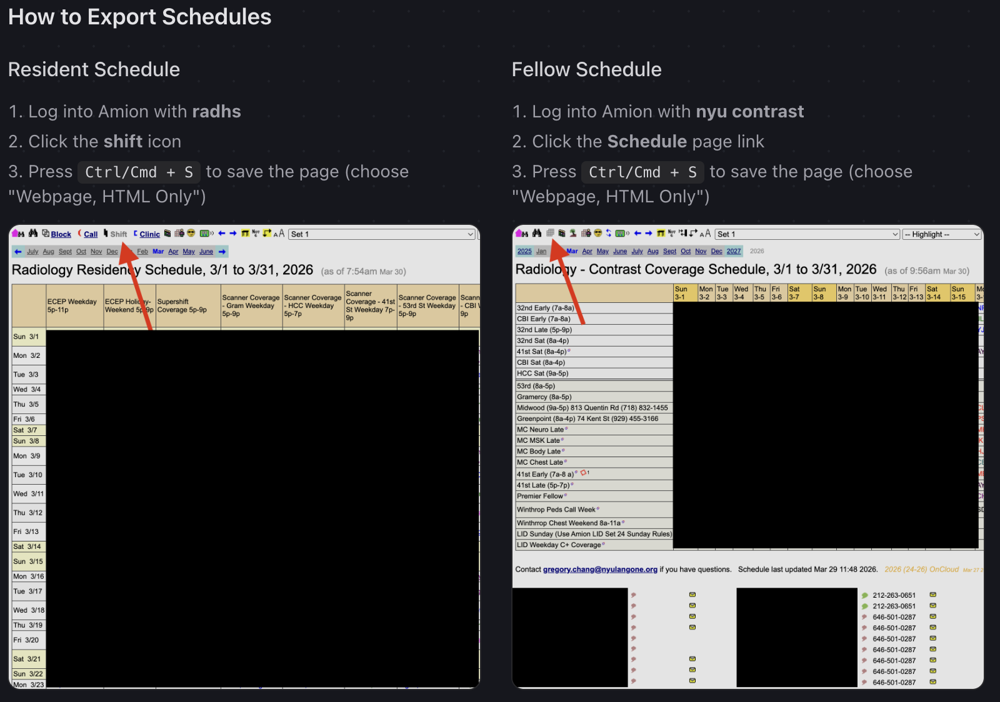

# Moonlighting Parser

A web-based tool to parse Amion HTML exports and generate trainee moonlighting summaries.

**Live Tool:** [https://sid-dogra.github.io/moonlighting_parser/](https://sid-dogra.github.io/moonlighting_parser/)

## How to Use

### Step 1: Download HTML files from Amion

Download two HTML files from Amion: the **Residency Schedule** and **Contrast Coverage Schedule**.



### Trainees.xlsx Format

Your `Trainees.xlsx` file should have:
- **Column A**: "Residents" in A1, with resident names listed below (one per row)
- **Column C**: "Fellows" in C1, with fellow names listed below (one per row)

| A | B | C |
|---|---|---|
| Residents | | Fellows |
| John Smith | | Jane Doe |
| Bob Jones | | Alex Lee |
| ... | | ... |

### Step 2: Upload files to the parser

1. Go to [https://sid-dogra.github.io/moonlighting_parser/](https://sid-dogra.github.io/moonlighting_parser/)
2. Upload your **Trainees.xlsx** file
3. Upload the **Residency Schedule HTML** file
4. Upload the **Contrast Coverage Schedule HTML** file
5. Enter the month name (e.g., "April")
6. Click **Parse and Generate Summary**
7. Download the resulting `.txt` summary file

## Output

The tool generates a summary showing each trainee's shifts and total hours:

```
April Moonlighting Summary
==================================================

John Smith
  04-01-2026 Gramercy weekday           4
  04-05-2026 CBI weekend                8
  Total:                                12

Jane Doe
  04-02-2026 ECEP                       6
  04-08-2026 53rd St weekend            8
  Total:                                14
```

## Privacy

All processing happens locally in your browser. No files are uploaded to any server.

## Updating Shift Mappings

The parser recognizes specific shift names from Amion. If new shifts are added to the schedule, the code will need to be updated to include the new shift names and their corresponding hours. See the `RESIDENCY_SHIFT_MAPPINGS` and `CONTRAST_SHIFT_MAPPINGS` objects in `docs/index.html`.

## Acknowledgments

Thanks to Ryan Cummings for the original idea and the screenshot.
